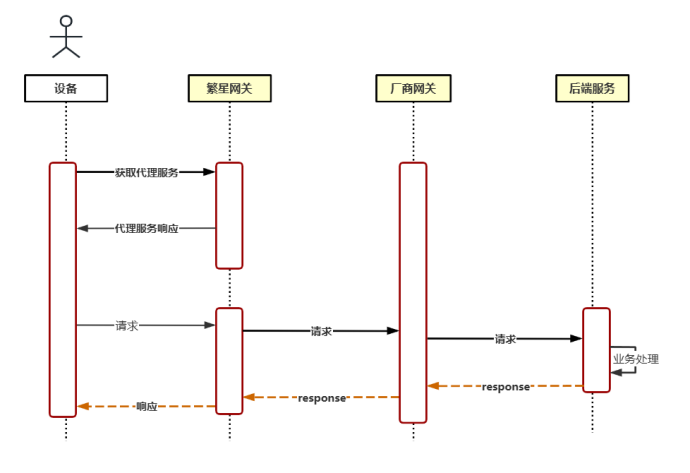

# Module AI-Assist SDK

## 1. 概述

### 版本信息
- SDK 版本：0.9.7
- 发布日期：2025-02
- 文档更新：2025-06-24

### 系统要求
- Android API Level：21+
- Java Version：11+
- Kotlin Version：1.8+

### 主要功能
- 网关服务集成
- 设备管理和连接
- AI 语音识别和对话
- 实时语音翻译
- NLU 中控
- 语音文件识别
- 内容摘要

## 2. 快速开始

### 依赖配置
```gradle
dependencies {

    implementation("com.squareup.okhttp3:okhttp:4.9.3")
    implementation("com.squareup.okhttp3:okhttp-sse:4.9.3")
    implementation("com.google.code.gson:gson:2.10.1")

    implementation platform('org.jetbrains.kotlin:kotlin-bom:1.8.0')
    implementation 'org.jetbrains.kotlinx:kotlinx-coroutines-android:1.7.1'
    implementation 'org.jetbrains.kotlinx:kotlinx-coroutines-core:1.7.1'

    implementation("com.jakewharton.timber:timber:4.7.1")
    implementation 'org.java-websocket:Java-WebSocket:1.5.1'
    implementation "androidx.annotation:annotation:1.5.0"
    
    // SDK
    implementation(name: 'deviceAccess_gatewayProxy-release_0.9.7_', ext: 'aar') // 设备管理、网关
    implementation(name: 'asrIntelligentDialogue-release_0.9.7_', ext: 'aar') // ASR 智能对话
    implementation(name: 'asrTranslation-release_0.9.7_', ext: 'aar') // 实时语音翻译
    implementation(name: 'aiFoundationKit-release_0.9.7_', ext: 'aar') // AI 功能基础工具包
}
```

### 权限配置
```xml
<uses-permission android:name="android.permission.RECORD_AUDIO" />
<uses-permission android:name="android.permission.INTERNET" />
<uses-permission android:name="android.permission.READ_EXTERNAL_STORAGE" />
<uses-permission android:name="android.permission.WRITE_EXTERNAL_STORAGE" />
```
### 混淆配置
```kotlin
-keep class com.cmdc.ai.assist.** {*;}
-keep class com.baidu.voicesearch.opus.** {*;}

```

### 初始化步骤
```kotlin
// 1. 创建配置
val config = AIAssistConfig.Builder()
    .setProductId("***")
    .setProductKey("***")
    .setDeviceNo("***")
    .setDeviceNoType("***")
    .build()

// 2. 检查配置是否有效,初始化 SDK 
if (config.isValid()) {
    // 使用配置初始化
    initialize(this, config)
}

// 3. 获取网关实例
val gateWay = getInstance().gateWayHelp()

// 4. 获取 asr 智能对话实例
val asr = getInstance().asrIntelligentDialogueHelp() as ASRIntelligentDialogue

// 5. 获取实时语音翻译实例
val asrTranslation = getInstance().asrTranslationHelp() as ASRTranslation

// 6. 获取 AI 功能基础工具包
val aiFoundationKit = getInstance().aiFoundationKit() as AIFoundationKit
```

## 3. 接口定义

### 配置管理
提供以下配置选项：
- 产品 ID 配置
- 产品密钥配置
- 设备编号配置
- 设备编号类型配置

### 网关服务
网关服务功能：
- 路由代理地址获取
- 设备信息获取
- 设备采集信息上报

### 智能语音识别
语音识别和对话功能：
- 实时语音识别
- 智能对话交互
- 语音命令处理
- 支持多轮对话

### 实时语音翻译
实时语音翻译功能：
- 中译英
- 英译中
- 支持多语言互译

### AI 功能基础工具包
提供基础性 AI 服务：
- 设备端中控 NLU 及问答、闲聊、文案创作等（支持多轮对话）
- 语音文件识别
- 内容摘要
- 语音识别（持续识别）

## 4. API 参考

### AIAssistConfig
配置管理类，用于设置 SDK 运行参数：
```kotlin
class AIAssistConfig private constructor(
    val productId: String,     // 产品 id
    val productKey: String,    // 产品 key
    val deviceNo: String,      // 设备编号
    val deviceNoType: String,  // 设备类型
)
```

### AIAssistantManager
SDK 核心管理类，提供以下功能：
- SDK 初始化
- 网关服务访问
- 设备管理
- ASR 智能对话
- 实时语音翻译
- AI 功能基础工具包

### GateWay
网关服务功能：
- 获取网关信息
- 获取设备信息
- 设备信息数据上报

### ASRIntelligentDialogue
ASR 智能对话功能：
- 语音识别
- TTS
- 闲聊
- 查询及问答
- 文本创作
- 文生图
- 播放音乐
- 意图识别

### ASRTranslation
ASR 实时翻译功能：
- 中译英
- 英译中
- 多语言互译

### AIFoundationKit
AI 功能基础工具包：
- NLU 中控（TTS、闲聊、查询及问答、文本创作、文生图、播放音乐、意图识别）
- 获取音频文件的上传 URL、访问 URL。
- 创建语音文件识别转写任务。
- 语音文件识别结果查询。
- 内容摘要（支持流式输出）
- 语音识别（持续识别）

## 5. 示例代码

### 基础示例
```kotlin
// 初始化示例
val config = AIAssistConfig.Builder()
    .setProductId("product_id")
    .setProductKey("product_key")
    .setDeviceNo("device_no")
    .setDeviceNoType("device_type")
    .build()

AIAssistantManager.initialize(context, config)

// 获取服务示例
val gateway = AIAssistantManager.getInstance().gateWayHelp()
val asr = AIAssistantManager.getInstance().asrIntelligentDialogueHelp() as ASRIntelligentDialogue
val asrTranslation = getInstance().asrTranslationHelp() as ASRTranslation
val aiFoundationKit = getInstance().aiFoundationKit() as AIFoundationKit
```

### 业务流程
```kotlin
// 完整业务流程示例
class AIAssistExample {
    
    fun initializeSDK(context: Context) {
        // 1. 创建配置
        val config = AIAssistConfig.Builder()
            .setProductId("product_id")
            .setProductKey("product_key")
            .setDeviceNo("device_no")
            .setDeviceNoType("device_type")
            .build()

        // 2. 初始化 SDK
        if (config.isValid()) {
            // 使用配置初始化
            AIAssistantManager.initialize(context, config)
        }

        // 3. 获取服务实例
        val manager = AIAssistantManager.getInstance()
        
        // 4. 使用各项服务
        
        // 获取网关服务
        val gateway = manager.gateWayHelp()
        // 获取 ADR 智能对话服务
        val asrIntelligentDialogue = manager.asrIntelligentDialogueHelp() as ASRIntelligentDialogue
        // 获取实时语音翻译实例
        val asrTranslation = getInstance().asrTranslationHelp() as ASRTranslation
        // 获取 AI 基础功能包
        val aiFoundationKit = getInstance().aiFoundationKit() as AIFoundationKit
        
    }

    /**
     * 获取设备信息
     *
     * 本函数旨在收集并获取当前设备的相关信息，包括：设备ID，平台上唯一设备标识；设备号，产品内唯一标识设备的序列号；产品ID，平台创建产品时生成；设备密钥，平台创建产品时生成
     * 这些信息将用于 AIAssistantManager 类中的其他功能，以确保 SDK 在设备中的正确使用
     */
    fun obtainDeviceInformation() {
        gateWay.obtainDeviceInformation({ response ->
            Timber.tag(TAG).d("%s%s", "response: ", response)
            getGateWay()
            dataReport()
        }, { error ->
            Timber.tag(TAG).e("%s%s", "error: ", error)
        })
    }

    /**
     * 获取网关信息
     *
     * 此方法用于获取当前系统的网关信息包含：
     * token，网关验证令牌，用于验证代理服务的合法性
     * expires，代理有效期（单位：秒），表示该代理服务的有效时间长度
     * status，状态码（1：使用代理，0：不使用代理），指示是否需要使用代理服务
     * "data": {
     *  "http": "https://域名:端口/p/http",
     *  "ws": "wss://域名:端口/p/ws"
     *  }
     */
    private fun getGateWay() {

        gateWay.getGateWay({ response ->
            Timber.tag(TAG).d("%s%s", "response: ", response)
        }, { error ->
            Timber.tag(TAG).e("%s%s", "error: ", error)
        })

    }

    /**
     * 执行设备参数采集上报
     *
     * ⼼跳接⼝/上报接⼝(定时向云端发送消息)
     * 设备（24小时至少上报一次）向云端上报信息，更新最后活动时间。
     *
     * 请求策略(参考)
     * 策略1：设备每天首次使用时上报设备数据信息。
     * 策略2：设备每隔12小时向平台上报设备数据信息。
     * 实施步骤：
     * 1. 设备初始化：设备首次启动时，向平台上报数据并记录上报时间T_current。
     * 2. 计算下次上报时间：设备每次上报数据后，记录当前时间 T_current ，并计算下次上报时间 T_next ：
     * T_next =T_current +12 小时+随机偏移量
     * 其中，随机偏移量可以是在-15分钟到+15分钟之间的一个随机值。
     * 3. 调度上报任务：设备根据计算出的 T_next 设置定时任务，确保在该时间点上报数据。
     * 注意：避免固定时间集中上报，造成服务器压力过大。
     *
     */
    private fun dataReport() {
        gateWay.dataReport(
            DeviceReportRequest(
                deviceId = "deviceId",
                deviceSecret = "deviceSecret",
                productId = "productId",
                productKey = "productKey",
                params = mutableMapOf() // 示例：params = mutableMapOf("key" to "value") 将需要采集的参数添加到 params 中
            ),
            { response ->
                Timber.tag(TAG).d("%s%s", "response: ", response)
            }, { error ->
                Timber.tag(TAG).e("%s%s", "error: ", error)
            })
    }

    /**
     * asr 智能对话
     *
     */
    private fun intelligentDialogue() {

        asrIntelligentDialogue.setListener(object : ASRIntelligentDialogue.RealtimeAsrListener {
            override fun onAsrMidResult(text: String) {
                // ASR 识别结果回调,返回中间状态的识别结果
            }

            override fun onAsrFinalResult(text: String) {
                // ASR 识别结果回调,返回最终状态的识别结果
            }

            override fun onDialogueResult(result: DialogueResult) {
                // 智能对话结果回调    
                
                    // 返回数据包的具体 id 
                    val qid = result.getQid()
                    // 本次智能对话结束标志
                    val isEnd = result.is_end()
                    // 智能对话完整回复内容
                    val assistantAnswerContent = result.getAssistant_answer_content()
                    // 返回通用渲染指令
                    val header = result.getHeader()
                    // 返回具体指令对应的字段信息
                    val payload = result.getPayload()

                    if (isEnd == 1) {
                        // 一次智能对话过程，返回的最后一个包
                        // assistantAnswerContent ：这时 ai 助手返回完整内容
                    }

                    try {
                        // 取出具体指令
                        val name = header.optString("name")
                        when (name) {
                            // 图片渲染进度指令
                            "RenderProcessing" -> {
                                val percent = payload?.optInt("percent")
                                Timber.tag(TAG).d("isGenerating = true 进度 ：%s", percent)
                            }
                            // 意图指令
                            "Nlu" -> {
                                // nlu
                                val nlu = payload?.optJSONArray("nlu")
                                Timber.tag(TAG).d("意图 ：%s", nlu?.toString())
                            }
                            // 意图标签指令
                            "NluTag" -> {
                                // nlu
                                val domain = payload?.optString("domian")
                                val intent = payload?.optString("intent")
                                Timber.tag(TAG).d("%s%s", "NluTag  = domain: $domain  ", "intent: $intent")
                            }
                            // 文生图结果指令
                            "RenderMultiImageCard" -> {
                                // 图片
                                val images = payload?.optJSONArray("images")
                                val pic = images.optJSONObject(0).optString("url")
                                Timber.tag(TAG).d("percent = 100 图片 ：%s", pic)
                            }
                            // 音乐播放指令
                            "Play" -> {
                                // 音乐
                                val mediaUrl = payload?.optJSONObject("audioItem")?.optJSONObject("stream")
                                    ?.optString("url")
                                val albumName =
                                    payload?.optJSONObject("audioItem")?.optString("extension")
                                Timber.tag(TAG)
                                    .d("%s%s", "Play  = mediaUrl: $mediaUrl  ", "albumName: $albumName")
                            }
                            // 查询及问答、闲聊、文本创作流式输出指令
                            "RenderStreamCard" -> {
                                // 流式
                                val text = payload?.optString("answer")
                                Timber.tag(TAG).d("answer content ：%s", text)
                            }
                            // 语音播放指令
                            "Speak" -> {
                                // tts
                                val ttlUrl = payload?.optString("url")
                                Timber.tag(TAG).d("%s%s", "Speak  = qid: $qid  ", "ttlUrl: $ttlUrl")
                            }
                        }
                    } catch (e: Exception) {
                        Log.e(TAG, "analyzePayload err : $e")
                    }
                    
            }

            override fun onError(code: Int, message: String) {
                // 智能对话过程中，出现异常回调
            }

            override fun onComplete() {
                // 一次智能对话完整过程结束之后，调用
            }
        })

        // 开始智能对话
        asrIntelligentDialogue.startRecognition(this.baseContext)
        
    }

    /**
     * 实时翻译
     * */
    private fun asrTranslation() {

        asrTranslation.setListener(object : ASRTranslation.ASRTranslationListener {
            override fun onMessageReceived(message: TranslationData?) {
                // 接收翻译结果
            }

            override fun onMessageReceived(bytes: ByteBuffer?) {
                // 返回 pcm 格式的 tts 音频播报数据
            }

            override fun onClose(code: Int, reason: String?, remote: Boolean) {
                // 当连接关闭时调用
            }

            override fun onError(ex: Exception?) {
                // 当发生错误时调用
            }
        })

        // 中译英
        asrTranslation.startRecognition(TranslationTypeCode.ZH_TO_EN)
        // 英译中
        //asrTranslation.startRecognition(TranslationTypeCode.EN_TO_ZH)
        // stop
        //asrTranslation.release()
    }

    /**
     * 中控 NLU
     * 此范例可代替 asr 智能对话的语音输入
     *
     */
    private fun insideRcChat() {

        val messages = AISessionManager.getChatDataList().buildMessagesInsideRcChat()
        messages.add(
            InsideRcChatRequest.Message(
                role = "user",
                content = "明天我和朋友准备去吃东北菜，我在石景山首钢园，朋友A在望京，朋友B在知春路，我们都在北京，你帮我们推荐几个价格在150元左右的餐厅吧"
            )
        )
        
        aiFoundationKit.insideRcChat(
            InsideRcChatRequest(
                qid = "***",
                third_user_id = "***",
                cuid = "deviceId",
                messages = messages,
                stream = true,
                dialog_request_id = "***"
            ),
            { response ->
                Timber.tag(TAG).d("%s%s", "response: ", response)
            }, { error ->
                Timber.tag(TAG).e("%s%s", "error: ", error)
            })
    }

    /**
     * 获取音频文件的上传 URL、访问 URL。此接口默认使用中国移动，移动云服务，如果厂商有自己的云文件存储，可不使用此接口。
     * */
    private fun getUploadAudioUrl() {
        aiFoundationKit.getUploadAudioUrl(
            UploadAudioUrlRequest(
                filename = "haha",
                filesize = "10"
            ),
            { response ->
                Timber.tag(TAG).d("%s%s", "response: ", response)
            }, { error ->
                Timber.tag(TAG).e("%s%s", "error: ", error)
            })
    }

    /**
     * 语音文件识别。 根据音频 url、音频格式、语言 id 以及采样率等参数创建音频转写任务。
     * */
    private fun speechFileTransfer() {
        aiFoundationKit.speechFileTransfer(
            SpeechRecognitionRequest(
                speech_url = "...",
                format = "pcm",
                pid = 80001,
                rate = 16000
            ),
            { response ->
                Timber.tag(TAG).d("%s%s", "response: ", response)
            }, { error ->
                Timber.tag(TAG).e("%s%s", "error: ", error)
            })
    }

    /**
     * 语音文件识别结果查询。
     * */
    private fun speechFileTransferQuery() {
        val taskIds = listOf(
            "67cd99f5f4df4b0001190119",
        )
        aiFoundationKit.speechFileTransferQuery(
            SpeechRecognitionQueryRequest(
                task_ids = taskIds
            ),
            { response ->
                Timber.tag(TAG).d("%s%s", "response: ", response)
            }, { error ->
                Timber.tag(TAG).e("%s%s", "error: ", error)
            })
    }

    /**
     * 内容摘要
     * */
    private fun contentSummary() {
        aiFoundationKit.contentSummary(
            ContentSummaryRequest(
                content = "近日，中国科学院宣布在量子计算领域取得重大突破。研究团队成功研发出新型量子计算芯片，实现了72个量子比特的稳定控制，大幅提升了量子计算的处理能力。该成果发表在国际顶级期刊《Nature》上，引起国际科学界广泛关注。专家表示，这一突破将加速量子计算在密码学、新材料开发、药物研发等领域的应用进程。中国科学院量子信息与量子科技创新研究院院长潘建伟教授指出，团队计划在未来三年内，进一步提升量子比特数量至100个以上，并着手解决量子计算实用化过程中的关键技术难题。此外，研究院已与多家高科技企业达成合作，共同推动量子计算技术的产业化应用。国家自然科学基金委员会表示将继续加大对量子计算领域的支持力度，促进基础研究与应用研究的协同发展。",
            ),
            { response ->
                Timber.tag(TAG).d("%s%s", "response: ", response)
            }, { error ->
                Timber.tag(TAG).e("%s%s", "error: ", error)
            })
    }

    private val speechRecognitionPersistent by lazy {
        aiFoundationKit.speechRecognitionPersistentHelp()
    }
    private val hanlder = Looper.myLooper()?.let { Handler(it) }

    /**
     * 语音识别（持续识别）
     * */
    private fun speechRecognitionPersistent() {

        speechRecognitionPersistent.setListener(object : SpeechRecognitionPersistent.ASRListener {
            override fun onMessageReceived(message: SpeechRecognitionPersistentData?) {
                // 接收翻译结果
            }

            override fun onMessageReceived(bytes: ByteBuffer?) {
                // 返回 pcm 格式的 tts 音频播报数据
            }

            override fun onClose(code: Int, reason: String?, remote: Boolean) {
                // 当连接关闭时调用
            }

            override fun onError(ex: Exception?) {
                // 当发生错误时调用
            }
        })

        // 中译英
        speechRecognitionPersistent.startRecognition()
        // stop
        hanlder?.postDelayed({
            speechRecognitionPersistent.cancel()
            //speechRecognitionPersistent.release()
        }, 30 * 1000)
    }
    
    
    
}
```

### 错误处理
```kotlin
try {
    val config = AIAssistConfig.Builder()
        .setProductId("product_id")
        .setProductKey("product_key")
        .build()

    // 检查配置是否有效
    if (config.isValid()) {
        AIAssistantManager.initialize(context, config)
    } else {
        Log.e("AIAssist", "Invalid configuration")
    }
} catch (e: Exception) {
    Log.e("AIAssist", "Initialization failed", e)
}
```

## 6. 常见问题

### 初始化问题
- Q: SDK 初始化失败怎么办？
- A: 检查配置参数是否完整，确保必需的权限已经授予。

### 权限问题
- Q: 需要哪些权限？
- A: 主要需要 RECORD_AUDIO（语音识别）和 INTERNET（网络通信）权限。

### 连接问题
- Q: 设备连接失败如何处理？
- A: 检查网络状态，确认设备标识是否正确，查看日志中的具体错误信息。

## 7. 代理网关使用说明



### 不使用代理的情况
- 响应状态码 status = 0
- HTTP 状态码不等于 200
- 接口网络请求异常

### 代理请求规则
- URL 转换示例
```
原始请求：
https://aqua-digital.aipaas.com/smart-channel-aggregation-hubtest/smartChannel/asr

代理请求：
https://域名:端口/p/http/smart-channel-aggregation-hubtest/smartChannel/asr

新增Header：
X-AI-PROXY-PASS: https://aqua-digital.aipaas.com
```
- 必需的请求头

| Header名 | 值 | 是否必须 | 说明 |
|----|------|---------|------|
| X-AI-PROXY-PASS | 原始请求URL | 是 | 需要填写完整的原始请求地址 |
| X-AI-UID | xxxx | 是 | 设备ID(设备注册下发的) |
| X-AI-VID | xxxx | 是 | 产品标识（产品注册获取） |

### 可信域名管理

#### 基本规则
- 仅限可信域名列表中的厂商使用繁星智算网关代理
- 域名必须包含端口号
- 域名列表需由厂商提供并审核

#### 可信域名列表示例

| 厂商名 | 域名和端口 | 业务描述 |
|----|------|---------|
| 示例a | https://aqua-digital.aipaas.com | 语音服务 |
| 示例b | https://aqua-digital2.aipaas.com | 翻译服务 |

### 可信域名管理
- 当发生网络异常时，系统自动切换到原始请求方式
- 代理服务有效期超过expires时间后，需重新获取代理地址
- 建议在应用层面实现自动重试机制

## 8. 设备信息上报说明

### 请求参数

| 字段              | 说明 | 值类型 | 是否必填 | 说明 |
|-----------------|------|-------|---------|-------|
| deviceId        | 设备ID，平台上唯⼀设备标识 | string | 是 |  |
| deviceSecret    | 设备密钥，与设备ID⼀⼀对应 | string | 是 |  |
| productId       | 产品ID，平台创建产品时⽣成 | string | 是 |  |
| productKey      | 产品密钥，平台创建产品时⽣成 | string | 是 |  |
| params          | 上报携带的参数 | map | 是 |  |
| +innerIp        | 内网IP | List<string> | 是 |  |
| +netSpeed        | 网络分级 （300Mbps） | string | 是 | 如无法获取，可以传固定（0Mbps） |
| +netType         | 网络类型（wifi，5G） | string |是 |  |
| +platform        | 操作系统 （Android11,RTOS） | string | 是 |  |
| +sdkVersion      | SDK版本（固定ai_前缀） | string | 是 | 使用api，传ai_http_1.0，若使用aisdk, aisdk内部根据实际版本号填充 |
| +firmwareVersion | 固件版本 | string | 是 |  |
| +imei            | imei(蜂窝类产品必传) | string | 是 | 获取不了，传空字符串("") |
| +cmei            | cmei（有则必传） | string | 是 | 获取不了，传空字符串("") |
| +mac             | mac地址 | string | 是 | 设备mac地址 （xx-xx-xx-xx-xx-xx） |

### 请求示例

```kotlin
{
    "deviceId": "123456789",
    "deviceSecret": "xxxxx",
    "productId": "1234567890123",
    "productKey": "xxxxxxx",
    "params": {
        "innerIp": [
            "10.229.111.172",
            "192.168.1.7"
        ],
        "netSpeed": "0Mbps",
        "netType": "WiFi",
        "platform": "rtos",
        "sdkVersion": "ai_http_1.0",
        "firmwareVersion": "0.0.5.2",
        "imei": "",
        "cmei": "",
        "mac": "XXXX"
    }
}
```